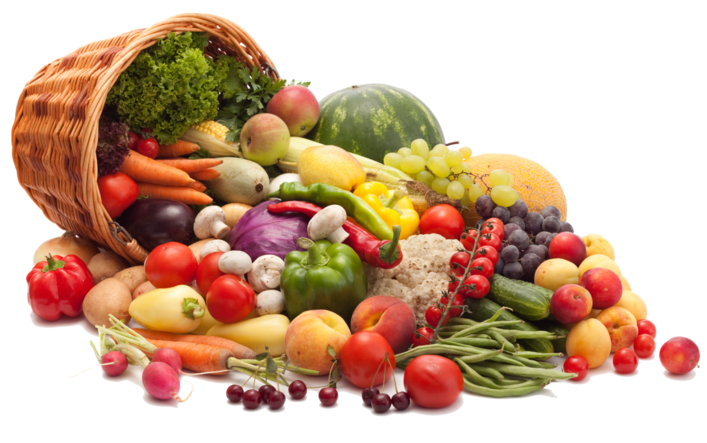
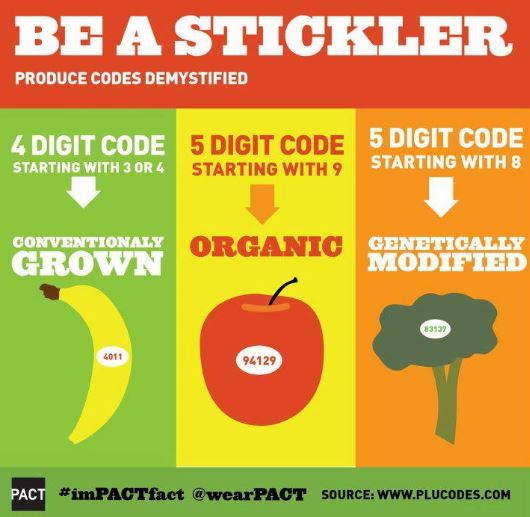
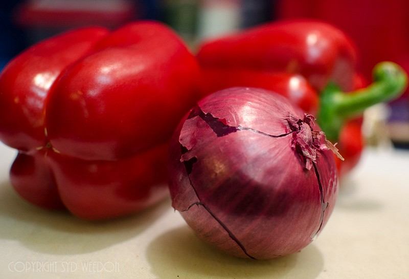
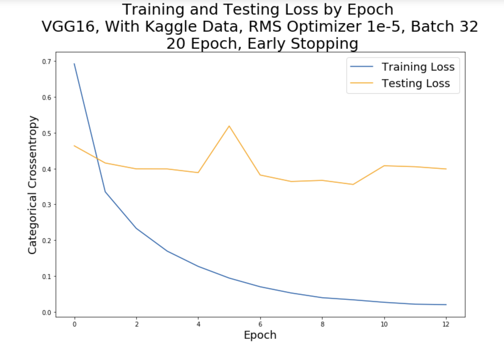
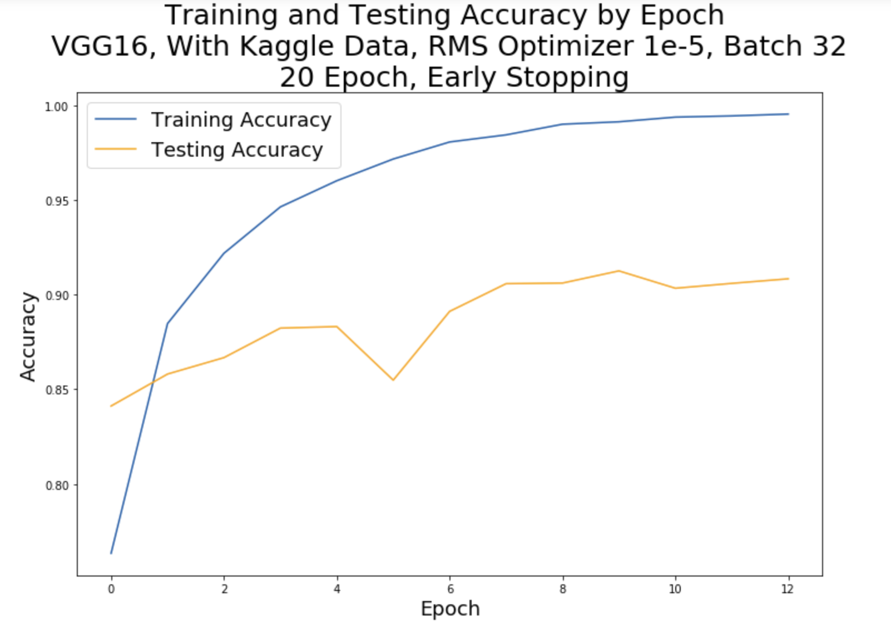

# Image Classification of Fruits and Vegetables
#### By: Erin Hwang

---
## Executive Summary

### Problem Statement
There are a lot of produce items priced by the pound. Unfortunately, many grocery stores use inefficient methods of processing fruits and vegetables at checkout. Typically, a cashier manually inputs a code identifying the product, or customers (at self checkout) must select the produce name they are purchasing on the self checkout touch screen. These methods are very outdated. It is imperative to create a machine that will accurately recognize specific fruits and vegetables to accelerate the process.  

 I will build a model that will accurately classify fruits and vegetables when produce items are scanned. 
 
**Audience**
- Grocery Stakeholders
- Self-Checkout Users
- Cashiers

**Why Do We Care?**
- Save time and time is money
- Could perform better than humans (potentially remove human error)

**Based on this image, memorizing produce codes can be forgetful especially for supermarkets like Ralphs, Vons, and Safeway since they sell both GMO and organic products.**

**Key Findings**
- Results 
    - My best model had a val_loss score of .3988 and an accuracy score of .9183
- Pretrained Convolutional Base (`VGG16` and `ImageNet`)
    - Keras offers pretained convolutional bases which increase accuracy scores when working with small datasets when weighted on `ImageNet`
    - My dataset consists of 24,881 images for all seven produce items (this is considered small)
    - I used the `VGG16` convolutional base and trained it on `ImageNet` which consists of 1.6 million images 
    - The ImageNet dataset is a benchmark in object category classification and detection on hundreds of object categories and millions of images. The challenge has been run annually from 2010 to present, attracting participation from more than fifty institutions.
    - It is very important to freeze the convolutional base when training on my fruit data. I want to freeze it so that my weights will not be updated when training on my fruit data. The weights are only updated when training on `ImageNet`. 
- RMSprop Optimizer  
    - The central idea of RMSprop is keep the moving average of the squared gradients for each weight. And then the optimzer divides the gradient by square root the mean square. Which is why it’s called RMSprop(root mean square). 

**Limitations**
- Data Collection
    - Collecting data was very tedious since I had to collect images of WHOLE fruits and vegatables. For instance, people at the grcery store don't purchase sliced lemons instead they would purchase whole lemons. 
    - In addition, there were a lot of images on Flickr I collected that were irrelevant. When I collected images of pears on Flickr, a lot of graffiti art appeared since there is a famous graffiti artist named pear. 
    - Since data cleaning took a long time, this led me to have a limited number of images. 
- Processing Power 
    - I modeled my data on GCP using 4 GPUs (NVIDIA P4). Before using the platform, each epoch took an estimated time of two hours (and I used 20 epochs for each model). Fortunately, modeling on the GCP shortened each epoch time to nine to ten minutes. Although this descreased waiting time, I wish it was faster so I can tune my model to bring more accurate val_loss scores. 
    - I'm pleased to have quicker epoch times so I implemented early stopping. But I wish I was able to have faster processing power to regularize my model more. 
    - If I had more time, I would've liked to train my model on other optimzers similar to RMSprop or even change the learning rate of the RMSprop. 

## Data

**Success Metric**
- Categorical Crossentropy (loss) score when executing convolutional neural networks
- It's illegal to overcharge customers and detrimental for companies to undercharge customers

**Data Sources**
- Retrieve ~20,000 fruits and vegetables from Kaggle (source is shown bottom of the README)
- Scrape photos on Flickr using Flickr API

**The Following Fruits and Vegetables I used are:**
- Apple 
- Tomato 
- Lemon
- Bellpepper
- Onion
- Pear
- Strawberry

### Notebook Information
**Folders**:
- `datasets`
- `FLASK`
- `images`
- `visuals`

**Notebooks**:
- `11_Scrape_FlickrAPI.ipynb`
- `12_resizing_images.ipynb`
- `13_image_to_array.ipynb`
- `14_df_setup.ipynb`
- `15_keras_time_GCP.ipynb`
---

***If this repository is cloned, please read the repository notes for further clarification***

**Repository Notes**
- Due to large datasets, CSV and image folders are not uploaded. 
- The `images` folder formats the folders specificed in `11_Scrape_FlickrAPI.ipynb` and `12_resizing_images.ipynb` for apples only. Note: these folders are empty. 
- Inside the `datasets` folder rests the `dataset_with_kaggle_pics` folder. Note: the `dataset_with_kaggle_pics` folder is empty but it is intended to have the seven CSV files that store the unraveled images transformed into pixels (one CSV file representing one produce item). 
- In notebook `03_{produce_name}_resize`, the folder `dataset_without_kaggle_pics` is mentioned because I also modeled without the Kaggle images. Note: `dataset_without_kaggle_pics` is not in the `datasets` folder. 
- You must download Kaggle images yourself once this repo is cloned. Please see the works cited section below for the Kaggle link. 

---

## Repository Walkthrough 
 
This portion of the README will walkthrough my workflow of the project in chronological order. Please follow along!

### Objective 1: Collect Images of Fruits and Vegetables 

**Data Source 1: Flickr API** 
- In `11_Scrape_FlickrAPI.ipynb`, I scraped seven specific fruits and vegetables using the Flickr API and saved them to a folder. This is where it gets tedious. Since I was scraping from Flickr, there is a chance an apple is not an apple; thus, I removed pictures not fit for modeling. In addition, I must check every image to make sure they are not contaminated. After I cleaned my Flickr data, I named it `01_{produce_name}_cleaned`. These folders will be stored in the `images` folder

Since I am classifying a single produce item, I can't have photos that contain a variety of fruits and vegetables. The following picture is an example of a contaminated photo:

**Data Source 2: Kaggle** 
- Fruits and vegetables were planted in the shaft of a low speed motor (3 rpm) and a short movie of 20 seconds was recorded. A Logitech C920 camera was used for filming the fruits. Behind the fruits, they placed a white sheet of paper as background. The folders of kaggle images are located in the `images` folder titled as `02_{produce_name)_uncleanedkaggle`. 

### Objective 2: Compile Flickr and Kaggle Images and Resize to 100x100 pixels 

**Checkpoint:** I compiled the images from both sources in Finder. At this point, I now have 7 folders. For example, the apple folder consists of Flickr and Kaggle images. *
**Note: the compiled folders are not in my `images` folder.*** 

- In `12_resizing_images.ipynb`, I resized my images to 100x100 pixels and saved the images to a folder called `03_{produce_name}_resize`. 

Here is a following table of number of images for each produce item:

|Produce Name|Image QTY|
|--|--|
|Apple|7,806|
|Bellpepper|2,571|
|Lemon|1,988|
|Onion|1,987|
|Pear|4,485|
|Strawberry|2,555|
|Tomato|3,489|
|**Total**|**24,881**|

### Objective 3: Use Compiled Folders to Transform Each Image into a Pandas Row 

**Checkpoint:** At this point, I have clean images in the `image` folder seperated by folders labled as `03_{produce_name}_resize`. 

- In `13_image_to_array.ipynb`, I read all my images by unraveling each image into an array of pixels. Once the image is transformed into an array, I appended the array of pixels to a pandas dataframe. Remember my image size is 100x100 in color. This means I will have 100x100x3 numbers since color images involve three dimensions due to the three primary colors (red, blue, green). I saved the pandas dataframe to a csv file located in the `datasets` folder which is then stored in the `dataset_with_kaggle_pics` folder. The file path is ./datasets/dataset_with_kaggle_pics. 

**Checkpoint:** In the file path './datasets/dataset_with_kaggle_pics', I have seven csv files where each file indicates a specific produce item. 

**Note:** I also modeled without using the Kaggle Images (hence the folder called `dataset_without_kaggle_pics`)

### Objective 4: Join all Seven CSVs

- In `14_df_setup.ipynb`, I read all seven CSVs to create one giant CSV file called `mama.csv` which is located in the `datasets` folder. I also shuffled the dataset after joining them. 

**Checkpoint:** In the `mama.csv`, I have 24,881 rows and 30,001 columns. 

### Objective 5: Implement CNN Models on the Google Cloud Platform

- I executed my notebook `15_keras_time_GCP.ipynb` in the GCP platform since I needed a lot of processing power to model my data. 

In this notebook I executed the following tasks before modeling:
- Read in `mama.csv`
- Mapped target column to numeric values (tomato:0, apple:1, lemon:2, bellpepper:3, onion:4, pear:5, strawberry:6)
- Train test split the data
- Convert X_train, X_test, y_train, y_test to numpy array 
- Convert pixels to 0 to 1 by dividing by 255
- Reshape X_train and X_test 
- One hot encode y_train and y_test using np_utils from keras

### Now it's Model Time!

- The key takeaway from this notebook is that I used a pretrained network offered by Keras. More importantly, I used the pretrained convolutional base called `VGG16` weighted on an image dataset called `ImageNet`. Feature extracting using pretrained networks tackles the problem of performing image classification with small datasets. The `VGG16` pretrained convolutional base is weighted on a set of images called `ImageNet` (which is also provided by Keras). If there’s one dataset that has been a catalyst for the rise of deep learning, it’s the ImageNet dataset, consisting of 1.4 million images that have been hand annotated with 1,000 image categories (1 category per image). `ImageNet` consists of animals and everyday objects; thus it is important to freeze the model after a certain point in order to prevent the weights from being updated during training. If you don’t do this, then the representations that were previously learned by the convolutional base will be modified during training. After `VGG16` is instantiated, I froze the model up until the `block5_conv1` layer. 

## Results 

 The following table will show my results with and without the Kaggle dataset in addition to using different pretrained convolutional bases. All models had a batch size of 32 with the RMS optimizer with a learning rate of 1e-5 (.00001). Early stoppers were implemented where patience = 3. 

 
|Kaggle Dataset|Convolutional Base|Epoch Size|Early Stopping|Val_Loss|Val_Acc|
|--|--|--|--|--|--|
|No|VGG16|5|No|.8624|.7218|
|No|VGG16|20|Yes|.8316|.7519|
|No|VGG19|20|Yes|.9731|.7248|
|No|MobileNetV2|20|Yes|1.8638|.4794|
|Yes|VGG16|20|Yes|**.3988**|**.9183**|
|Yes|VGG19|20|Yes|.4437|.8796|

**Note:**
- Image QTY without Kaggle: 9,144
- Image QTY with Kaggle: 24,881

#### Here are the graphs of our best predicted model

## Overall Conclusions and Recommendation 

**Final Results**
- I created a model with "decent" scores (val_loss score of .3988 and val_acc score of .9183) but there are ways of improving this model. 

Here are my recommendations:
- Collect more uncontaminated colored data (THIS IS VERY IMPORTANT)
    - Ideally, I wanted ~10,000 images per produce item. 
    - Increasing image QTY from 24,881 to 70,000 will greatly improve scores,
- Increase Processing Power 
    - Increasing processing power would allow me to tune and regularize my model to achieve better scores.  
    - This will give me the opportunity to change learning rates and determine the best one
- Research
    - Different convolutional bases 
    - Different optimizers 

**Thank you for taking the time to read this!**

## Works Cited 

- Kaggle Dataset
    - Horea Muresan, Mihai Oltean, Fruit recognition from images using deep learning, Acta Univ. Sapientiae, Informatica Vol. 10, Issue 1, pp. 26-42, 2018.
- Flickr API Framework Code 
    - Yunjey Choi 
    - https://gist.github.com/yunjey/14e3a069ad2aa3adf72dee93a53117d6
- Google Cloud Platform Youtube Tutorial 
    - Aditya Sharma
    - https://www.youtube.com/watch?v=gMDQZPoMECE&list=PLmMsypEcVPfYGg83U7ZN97TallN-FHivP&index=1 
- Deep Learning with Python (Book)
    - “Chapter 5.” Deep Learning with Python, by Chollet François, Manning Publications Co., 2018, pp. 120–160.
- Flask APP Code
    - Username: mtobeiyf
    - Repository: keras-flask-deploy-webapp
    - https://github.com/mtobeiyf/keras-flask-deploy-webapp
